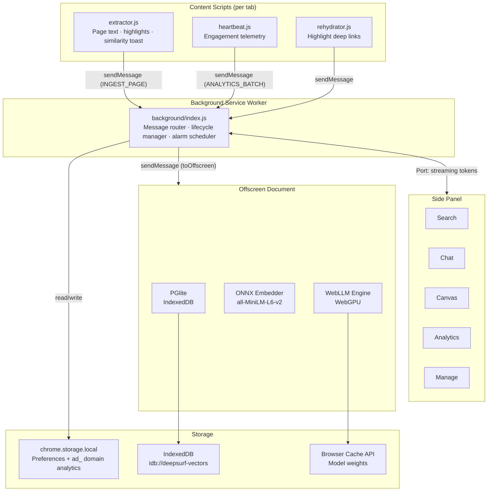

<div align="center">
  
</div>

# DeepSurf History Manager

A privacy-first browser extension that indexes your browsing history locally, enables semantic and full-text search over visited pages, provides an on-device RAG chat interface, surfaces behavioral analytics, and offers a visual canvas for organizing research highlights. All data and model inference run entirely on-device; no data leaves the browser.

---

## Table of Contents

- [Features](#features)
- [Architecture Overview](#architecture-overview)
- [Directory Structure](#directory-structure)
- [Data Storage](#data-storage)
- [Message Bus](#message-bus)
- [Prerequisites](#prerequisites)
- [Installation](#installation)
  - [Development Build](#development-build)
  - [Production Build](#production-build)
  - [Loading the Extension in Chrome](#loading-the-extension-in-chrome)
- [Configuration](#configuration)
- [Scripts](#scripts)
- [Permissions](#permissions)
- [Privacy Model](#privacy-model)
- [Known Constraints](#known-constraints)

---

## Features

### Hybrid Semantic Search
Every page you visit is automatically extracted, cleaned, and ingested into a local PGlite (PostgreSQL-in-WASM) database. Each page is embedded using an ONNX-compiled `all-MiniLM-L6-v2` sentence transformer model running in the browser via `@xenova/transformers`. At query time, results from a cosine similarity vector search and a full-text GIN index search are blended using Reciprocal Rank Fusion (RRF).

### On-Device RAG Chat
An on-device large language model is loaded via WebLLM (`@mlc-ai/web-llm`) and runs on the GPU through WebGPU. When you ask a question, the top semantically matched pages from your history are retrieved and injected into the model's context window. The LLM streams a response token-by-token back to the side panel. The model is unloaded from VRAM when the side panel is closed.

### Similarity Toast Notification
When you navigate to a new page, the extractor content script compares the page embedding against existing history. If a sufficiently similar page is found, a non-blocking overlay notification appears in the corner of the page, linking to the previously visited content.

### Research Canvas
A node-graph workspace rendered on an SVG canvas inside the side panel. You can highlight text on any page, save it as a node via a floating selection toolbar that appears on text selection (offering Quick Save to Inbox or Add to Thread), organize nodes into named threads, draw edges between nodes to express relationships, label edges, and apply a force-directed physics simulation to auto-arrange the graph. Nodes and edges are persisted in PGlite.

### Behavioral Analytics
A dedicated analytics tab renders Chart.js visualizations derived from two data sources: domain visit records stored in `chrome.storage.local` (written by `analyticsTracker.js`) and high-frequency telemetry pulses stored in the `telemetry_pulses` PGlite table (written by `heartbeat.js`). Charts include:

- Domain time distribution treemap (from `chrome.storage.local` visit counts)
- Hourly activity heatmap across days of the week (from `chrome.storage.local` hourly distributions)
- New domain discovery timeline (from `chrome.storage.local` first-visited timestamps)
- Attention Gini coefficient measuring inequality of focus across sites (from PGlite pulses)
- Markov chain transition probabilities between domains (from PGlite pulses)
- Session timeline with median attention span (from PGlite pulses)
- Behavioral velocity chart (scroll rate, interaction density, mouse erraticism) (from PGlite pulses)

`analyticsTracker.js` runs inside the background service worker, listens to `chrome.webNavigation.onCompleted`, and batches writes to `chrome.storage.local` every 60 seconds using a sequential promise mutex to prevent concurrent write races.

### History Management
The Manage tab allows browsing, searching, and bulk-deleting entries from the local history database. An optional auto-prune alarm runs every 24 hours to remove entries older than a configurable threshold.

### SPA Navigation Support
The background service worker listens to `chrome.webNavigation.onHistoryStateUpdated` events and notifies content scripts to re-run extraction on client-side navigation in single-page applications.

---

## Architecture Overview

The extension is composed of five isolated execution contexts that communicate through a typed message bus.



### Background Service Worker

`background/index.js` is the central message router. It also imports `analyticsTracker.js`, which runs in the same service worker context and independently tracks page completions via `chrome.webNavigation.onCompleted`, writing domain visit counts and hourly distributions to `chrome.storage.local` under `ad_`-prefixed keys. The router maintains:

- A registry of active side panel `chrome.runtime.Port` connections for streaming chat tokens.
- A queue of messages that arrived before the offscreen document was ready.
- An idle-close timer that tears down the offscreen document 30 seconds after the last message completes, provided no side panel is open.
- A `chrome.alarms` listener for scheduled history pruning.

All messages destined for the database or models are forwarded to the offscreen document via `toOffscreen()`, which handles creation, retry on transient failure, and message queuing during initialization.

### Offscreen Document

`offscreen/index.js` is a persistent hidden HTML page that bypasses the service worker's short execution lifetime. It owns:

- **PGlite instance** — PostgreSQL running in WASM, persisted to IndexedDB under the key `deepsurf-vectors`. The schema includes a `pages` table with an HNSW vector index and a GIN full-text index, a `telemetry_pulses` table, and `canvas_threads`, `canvas_nodes`, and `canvas_edges` tables.
- **ONNX Embedder** — `@xenova/transformers` pipeline using `Xenova/all-MiniLM-L6-v2`, producing 384-dimensional embeddings. A `globalEmbedMutex` promise chain serializes embed calls to prevent concurrent WASM heap corruption. Each embed call also enforces a 30-second hard timeout to recover from WASM freezes.
- **WebLLM Engine** — loaded on demand via `@mlc-ai/web-llm`, runs inference on WebGPU. The engine is unloaded from VRAM when the side panel disconnects.

### Content Scripts

Three scripts run at `document_idle` on every HTTP/HTTPS page:

- `extractor.js` — strips HTML to clean text, sends `INGEST_PAGE`, displays similarity toasts, and manages a floating selection toolbar injected into the host page inside a closed shadow DOM element. The toolbar appears on text selection (`mouseup`) and offers two actions: Quick Save (adds the highlight directly to the Inbox) and Add to Thread (opens the canvas thread picker in the side panel).
- `rehydrator.js` — restores saved canvas highlights on page load by walking the DOM, flat-mapping all text nodes into a single string, finding the best match for each stored highlight text using exact flexible regex or a sliding-window fuzzy search (requiring at least 70% word overlap), and wrapping matched ranges in `<mark>` elements styled with a purple underline. Rehydration re-runs on SPA navigation and `popstate` events.
- `heartbeat.js` — collects engagement signals (active seconds, scroll distance, scroll direction changes, interaction count, mouse travel distance, media play state) and batches them as `ANALYTICS_BATCH` messages every 10 seconds. The batch is also flushed immediately when the tab is hidden or unloaded. Individual pulses accumulate in memory and trigger an early flush once the batch reaches 20 entries.

### Side Panel

`sidepanel/index.svelte` is the root Svelte 5 component. It manages a persistent `chrome.runtime.Port` named `sidepanel-chat` for streaming token delivery and renders five tab components:

| Tab | Component | Purpose |
|---|---|---|
| Search | `SearchBar`, `ResultCard` | Hybrid search with snippet previews |
| Chat | `ChatInput`, `ChatMessage` | RAG chat over history |
| Canvas | `ResearchCanvas` | SVG node-graph research workspace |
| Analytics | `AnalyticsTab` | Chart.js behavioral dashboards |
| Manage | `ManageTab` | History browsing and deletion |

---

## Directory Structure

```
DeepSurf/
├── background/
│   ├── index.js              # Service worker, message router
│   └── analyticsTracker.js   # Background analytics aggregation
├── components/
│   ├── AnalyticsTab.svelte   # Behavioral analytics charts
│   ├── ChatInput.svelte      # Chat input with abort control
│   ├── ChatMessage.svelte    # Streamed message renderer
│   ├── Logo.svelte           # Brand mark
│   ├── ManageTab.svelte      # History management UI
│   ├── ModelStatus.svelte    # Embedder and LLM load indicators
│   ├── ResearchCanvas.svelte # SVG canvas node-graph editor
│   ├── ResultCard.svelte     # Search result card
│   ├── SearchBar.svelte      # Search input component
│   ├── Setup.svelte          # First-run onboarding flow
│   └── TabNav.svelte         # Side panel tab bar
├── contents/
│   ├── extractor.js          # Page text extraction, highlight toolbar
│   ├── heartbeat.js          # Engagement telemetry collection
│   └── rehydrator.js         # Highlight rehydration on deep links
├── lib/
│   ├── analyticsProcessor.js # Domain categorization, chart data prep
│   ├── behavioralMath.js     # Markov chains, Gini, sessionization
│   ├── messages.js           # Frozen IPC message type enumeration
│   ├── utils.js              # HTML cleaning, URL normalization, ID hashing
│   └── vectorUtils.js        # Cosine similarity, RRF, pgvector serialization
├── offscreen/
│   ├── index.html            # Offscreen document shell
│   └── index.js              # PGlite, ONNX embedder, WebLLM host
├── public/
│   └── icons/                # Extension icon assets (16–512px)
├── scripts/
│   ├── package.js            # ZIP packaging script for store submission
│   └── test.js               # Puppeteer integration test suite
├── sidepanel/
│   ├── index.html            # Side panel HTML shell
│   ├── index.js              # Side panel entry point
│   └── index.svelte          # Root Svelte 5 side panel component
├── styles/
│   └── global.css            # Tailwind base and global overrides
├── manifest.base.json        # Chrome MV3 manifest source
├── package.json
├── pnpm-workspace.yaml
├── postcss.config.cjs
├── tailwind.config.cjs
├── tsconfig.json
└── vite.config.js
```

---

## Data Storage

All persistent data is stored locally in the browser with no external network calls.

### IndexedDB — PGlite (`idb://deepsurf-vectors`)

| Table | Key columns | Notes |
|---|---|---|
| `pages` | `id`, `url`, `title`, `text`, `visited_at`, `embedding vector(384)` | HNSW index on embedding; GIN index on full-text |
| `telemetry_pulses` | `id`, `session_id`, `domain`, `url`, `timestamp`, engagement metrics | Indexed on `timestamp` |
| `canvas_threads` | `id`, `name`, `created_at` | Named research workspaces |
| `canvas_nodes` | `id`, `thread_id`, `type`, `text`, `annotation`, `url`, `xpath`, `pos_x`, `pos_y`, `embedding vector(384)` | Cascade-deleted on thread removal |
| `canvas_edges` | `id`, `thread_id`, `source_id`, `target_id`, `score`, `manual`, `label` | Graph edges between nodes |

### `chrome.storage.local`

Stores user preferences (`autoPruneEnabled`, `autoPruneThreshold`, `telemetryEnabled`, `isDemoMode`) and domain analytics data written by `analyticsTracker.js`. Analytics entries use the key prefix `ad_` followed by the domain hostname. Each entry contains `totalVisits`, `firstVisited`, `lastVisited`, and `hourlyDistribution` (a map of `Day_Hour` strings to visit counts). Writes are batched in memory and flushed every 60 seconds.

---

## Message Bus

All cross-context communication uses a typed message enumeration defined in `lib/messages.js`. The full set of message types is grouped by function:

- **Lifecycle** — `OFFSCREEN_READY_PING`, `KEEPALIVE`, `DB_READY`
- **Ingestion** — `INGEST_PAGE`, `SPA_NAVIGATION`
- **Search and chat** — `SEARCH_HYBRID`, `CHAT_STREAM_START`, `CHAT_STREAM_ABORT`, `CHAT_TOKEN`, `CHAT_DONE`, `CHAT_ERROR`
- **Model control** — `GET_MODEL_STATUS`, `MODEL_STATUS_UPDATE`, `INIT_MODELS`, `UNLOAD_LLM`
- **History** — `GET_STATS`, `GET_PAGES`, `DELETE_HISTORY`, `PRUNE_HISTORY`, `SYNC_HISTORY`
- **Canvas** — `CANVAS_GET_THREADS`, `CANVAS_CREATE_THREAD`, `CANVAS_DELETE_THREAD`, `CANVAS_RENAME_THREAD`, `CANVAS_GET_NODES`, `CANVAS_GET_INBOX`, `CANVAS_ADD_NODE`, `CANVAS_DELETE_NODE`, `CANVAS_UPDATE_NODE`, `CANVAS_GET_EDGES`, `CANVAS_ADD_EDGE`, `CANVAS_DELETE_EDGE`, `CANVAS_LABEL_EDGE`, `CANVAS_OPEN_PICKER`, `GET_NODES_BY_URL`, `GET_PENDING_HIGHLIGHT`
- **Analytics** — `ANALYTICS_PULSE` (single pulse, routed to PGlite), `ANALYTICS_BATCH` (array of pulses sent by `heartbeat.js`, routed to PGlite), `GET_BEHAVIORAL_STATS`, `INJECT_DEMO_PULSES`, `RESET_DEMO_DB`

---

## Prerequisites

| Requirement | Version |
|---|---|
| Node.js | 18 or later |
| pnpm | 8 or later |
| Google Chrome | 116 or later (WebGPU and Offscreen Documents API required) |

Install pnpm if not already present:

```bash
npm install -g pnpm
```

---

## Installation

### Development Build

```bash
# Clone the repository
git clone <repository-url>
cd DeepSurf

# Install dependencies
pnpm install

# Start the Vite dev server with HMR
pnpm dev
```

The dev server runs on port 5173. With HMR active, changes to Svelte components are reflected immediately without a full rebuild.

> Note: The Vite dev server is used for component development only. The extension must be loaded from a built `dist/` directory in Chrome. Run a production build and reload the extension in `chrome://extensions` after changes to background scripts, content scripts, or the manifest.

### Production Build

```bash
pnpm build
```

This runs `vite build`, which:

1. Compiles all Svelte components and TypeScript sources.
2. Bundles the CRXJS plugin output into `dist/`.
3. Copies ONNX runtime WASM binaries (`ort-wasm.wasm`, `ort-wasm-simd.wasm`, `ort-wasm-simd-threaded.wasm`) from `node_modules/@xenova/transformers/dist/` into `dist/assets/`. These are required for in-browser ONNX inference without CDN requests.

To build and package a ZIP for Chrome Web Store submission:

```bash
pnpm release
```

This runs `pnpm build && pnpm zip`. The ZIP is written by `scripts/package.js` using `adm-zip`.

### Loading the Extension in Chrome

1. Open Chrome and navigate to `chrome://extensions`.
2. Enable **Developer mode** using the toggle in the top-right corner.
3. Click **Load unpacked**.
4. Select the `dist/` directory generated by the build.
5. The DeepSurf icon will appear in the Chrome toolbar.
6. Click the icon to open the side panel.

After any rebuild, click the refresh icon on the extension card in `chrome://extensions` to reload it.

---

## Configuration

User-facing settings are available in the Setup and Manage tabs within the side panel. The following preferences are written to `chrome.storage.local`:

| Key | Type | Description |
|---|---|---|
| `autoPruneEnabled` | boolean | Whether the daily auto-prune alarm deletes old history |
| `autoPruneThreshold` | number | Age in days beyond which history entries are pruned |
| `telemetryEnabled` | boolean | When set to `false`, disables both the `heartbeat.js` content script (stops engagement pulse collection) and the `analyticsTracker.js` background listener (stops domain visit counting). Defaults to enabled if the key is absent. |
| `isDemoMode` | boolean | Loads synthetic browsing data for demonstration purposes |

---

## Scripts

| Command | Description |
|---|---|
| `pnpm dev` | Start Vite dev server with HMR on port 5173 |
| `pnpm build` | Production build to `dist/` |
| `pnpm zip` | Package `dist/` into a ZIP for store submission |
| `pnpm release` | Run `build` then `zip` in sequence |

The `scripts/test.js` file contains a Puppeteer-based integration test suite for automated end-to-end validation of the extension in a headless Chrome environment.

---

## Permissions

The extension declares the following Chrome permissions:

| Permission | Reason |
|---|---|
| `storage`, `unlimitedStorage` | Persist PGlite IndexedDB database without Chrome's standard storage quota limits |
| `sidePanel` | Render the DeepSurf UI in the Chrome side panel |
| `offscreen` | Create a persistent offscreen document to host WebGPU and WASM contexts outside the service worker |
| `tabs` | Read active tab metadata for page ingestion |
| `history` | Access Chrome's native history API for initial sync |
| `webNavigation` | Detect SPA client-side navigation events |
| `alarms` | Schedule the daily auto-prune background task |
| `<all_urls>` (host permission) | Inject content scripts on all HTTP/HTTPS pages for text extraction and telemetry |

The `content_security_policy` for extension pages permits `wasm-unsafe-eval` to allow WASM execution required by PGlite and the ONNX runtime.

---

## Privacy Model

DeepSurf is designed to operate without any external data transmission. Specifically:

- All page text, embeddings, telemetry, and canvas data are stored in IndexedDB on the local machine.
- The embedding model weights (`all-MiniLM-L6-v2`) are downloaded once from Hugging Face on first use and cached in the browser via the Cache API (`transformersEnv.useBrowserCache = true`). No page content is sent during this download.
- The LLM weights are downloaded via WebLLM's CDN on first load and cached locally. Inference runs entirely on the local GPU via WebGPU.
- Setting `telemetryEnabled` to `false` in storage prevents both the `heartbeat.js` content script and the `analyticsTracker.js` background listener from collecting data, stopping all engagement signal and domain visit recording.
- No analytics, usage metrics, or identifiers are sent to any remote endpoint.

---

## Known Constraints

- **WebGPU requirement** — The on-device LLM requires WebGPU support. Chrome 113 and later support WebGPU on most platforms. On systems without a compatible GPU or driver, the LLM will fail to initialize; hybrid search and the analytics features remain fully functional without it.
- **First-load model download** — On first use, the ONNX embedding model (~23 MB) and the LLM weights are downloaded and cached. The LLM is always `Llama-3.2-1B-Instruct`. The quantization variant is selected at runtime based on GPU capability: `q4f16_1-MLC` (float16) on hardware with `shader-f16` support, and `q4f32_1-MLC` (float32) on lower-end hardware. Subsequent loads use the browser cache.
- **Service worker lifetime** — Chrome terminates idle Manifest V3 service workers after roughly 30 seconds. DeepSurf mitigates this by delegating all long-running work to the offscreen document and using a queued message system to replay any messages that arrive during a cold start.
- **Single-threaded ONNX** — `ort.wasm.numThreads` is set to 1 to avoid SharedArrayBuffer cross-origin isolation requirements, which are not available in extension contexts. This reduces embedding throughput on multi-core machines.
- **Tab context isolation** — Content scripts cannot communicate directly with the offscreen document. All messages pass through the background service worker.
